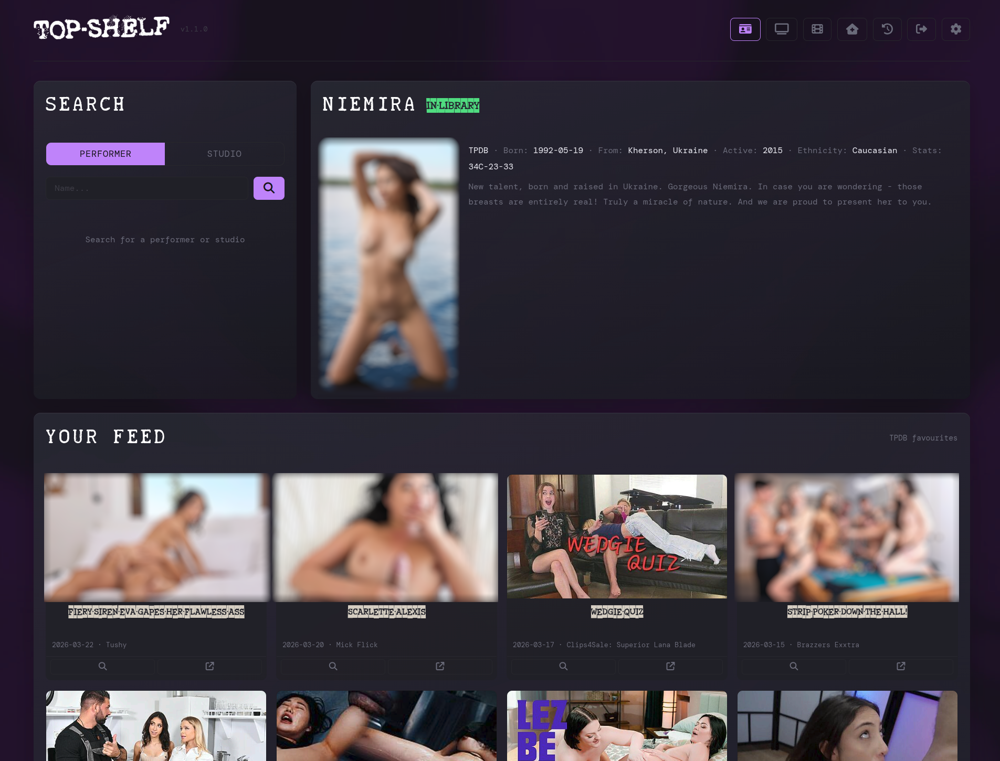

<p align="center">
  
</p>

A self-hosted media filing tool that uses perceptual hashing to automatically identify and organise adult content by matching against StashDB, ThePornDB, and FansDB.

---

## How it works

Top-Shelf watches your download folders and automatically processes video files through a pipeline:

1. Computes a perceptual hash from each video using Stash's algorithm
2. Queries StashDB, ThePornDB, and FansDB in order, stopping at the first match
3. Routes matched files to the correct library folder based on studio or performer (and optional **library index** crosswalk from your Favourites / linked IDs)
4. Generates Kodi-compatible NFO metadata and downloads thumbnails
5. Optionally submits phashes back to StashDB to improve the database

Files that don't match automatically can be filed manually through the web interface with full metadata search and entry.

---

## Pages

### Scenes (default home — `/` and `/scenes`)

Single page with search, feed, and Prowlarr:

- **Search** — performers or studios across StashDB, ThePornDB, and FansDB. Results show images, library status, and let you create TVShow folders.
- **Detail** — spotlight of a random library performer on load; when you pick a result, full profile (poster, bio, stats, aliases, links, directory picker).
- **Scene feed** — TPDB scene cards (thumbnails, titles, dates, studios). Toggle **Recent** / **Random** / **favourites**:
  - **Recent** — newest scene releases from TPDB’s global list (respecting your content filters).
  - **Random** — samples random performer folders from your library, merges recent scenes per performer, dedupes and sorts by date (falls back to Recent if you have no performer folders).
  - **favourites** — scenes involving **heart-starred** rows on the **Favourites** page that have a **TPDB** link.
  Click a card to open details; Prowlarr search sits below for grabs.
- **Prowlarr** — search indexers and send NZBs or torrents to your client (same row as on other main pages).

<p align="center">
  
</p>

### Queue (`/queue`, `/dashboard`, `/tv`, `/settings`)

The processing dashboard (queue UI is shared with settings on some routes):

- **Stats** — filed, unmatched, no directory, errors (links into History where applicable)
- **Queue** — files in your scene source directory with status, size, phash cache
- **Log** — live processing log
- **History snippet** — recent activity
- **Manual filing** — search databases, pick a scene, file with optional StashDB submission
- **Mode toggle** — **Scenes** vs **Movies** queue when both are configured

<p align="center">
  
</p>

### Downloads (`/downloads`)

Unified view of NZB/torrent clients with queue/history, categories, and **Import** (and optional **Remove from client after import**). If the client reports paths that only exist on another machine (e.g. `/share/...` on the NAS while Top-Shelf sees `/downloads/...`), imports map by **path relative to the torrent save path** onto your configured **Download watch directory** (scene jobs) or **Movies input folder** (movie jobs), so the same folder layout under your bind mounts is enough.

### Favourites (`/favourites`)

Indexed performer and studio folders with TPDB / StashDB / FansDB linking (scan or manual), hearts for starring, locks for match protection, and actions to search or refresh matches. Feeds the **favourites** scene feed on the Scenes page.

### Movies (`/movies`)

TMDB-powered movie filing: search, preview, file into your Features tree with NFO and artwork; separate latest/search flows as implemented in the UI.

### Library (`/library`)

Maintenance scans: NFO without video, video without NFO, missing thumbnails, empty folders.

### History (`/history`)

Full filing history with filters, search, sorting, and pagination.

---

## Automation

### Folder Watch

Monitors your **scene input** directory for new files. After the configured hold time without changes, each file runs through the full pipeline.

### Download Folder Watch

Monitors your **download watch** directory for completed downloads. Strips junk, can rename gibberish filenames from the parent folder name, and moves video into the **scene input** folder for processing.

### Automatic Retry

Reruns the pipeline on unmatched files on a schedule so new database entries can match later.

### Favourites scan

Scheduled (optional) refresh of Favourites index / matching — configured in Settings alongside other jobs.

### TPDB Favourites Sync

Bidirectional sync between your library and ThePornDB favourites:

- **Library → TPDB** — performer/studio directories searched on TPDB and added to your TPDB favourites (when enabled)
- **TPDB → Library** — TVShow folders for favourited performers not yet present locally

Runs on a schedule or manually from Settings.

---

## Download Integration

### Prowlarr

Search across configured indexers from the Scenes page (and related UIs). Grabs go to your NZB or torrent client with category assignment.

### Download Clients

Direct API integration (no Prowlarr required for client credentials):

- **NZB:** NZBGet, SABnzbd
- **Torrent:** qBittorrent, Transmission, Deluge

Handles magnet redirects, qBittorrent CSRF, and categories. **Import** uses the same post-processing as download-folder watch; path resolution prefers direct visibility, then prefix mapping, then **save-path–relative** mapping to your watch/movies folders when the client and Top-Shelf use different roots (e.g. Docker).

---

## Media Server Integration

Triggers library scans after filing on Stash, Jellyfin, Plex, and Emby. Scans are debounced so bursts of files still coalesce.

---

## File Routing

### Series routing

Matches the scene’s studio to subfolders under your **Series** directory.

### Performer routing

Matches performers against configured performer directory roots in order. Prioritises female performers by default; optional alias expansion when enabled.

### Library index (Favourites crosswalk)

When enabled, queue routing can use folder ↔ database ID links from the Favourites index before pure name/alias matching.

### Naming patterns

Configurable tokens: `{title}`, `{studio}`, `{performer}`, `{performers}`, `{year}`, `{month}`, `{day}`, `{date}`, `{source}`.

Default patterns:

- Series: `{studio} - S{year}E{month}{day} - {title}`
- Performer: `{performer} - S{year}E{month}{day} - {studio} - {title}`

Files go under a `Season YYYY` subfolder automatically.

---

## Quick start

1. Create your data directory:
   ```bash
   mkdir -p /your/path/database
   ```

2. Copy `docker-compose.yml` and edit volume paths (library, downloads, and database).

3. Start the container:
   ```bash
   docker compose up -d
   ```

4. Open `http://<your-server-ip>:8891` (you’ll land on **Scenes**).

5. Set a password, add API keys, and configure directories in **Settings**.

---

## docker-compose.yml

```yaml
services:
  top-shelf:
    image: thefilthycount/top-shelf:latest
    container_name: top-shelf
    restart: unless-stopped
    ports:
      - "8891:8891"
    volumes:
      - /your/path/database:/app/database
      - /your/library/path:/library
      - /your/downloads/path:/downloads
    environment:
      - TZ=Europe/London
```

Mount paths so **Download watch**, **scene input**, and **movies input** in Settings match real paths inside the container (same idea as your torrent client if it runs elsewhere).

---

## API keys

| Service | Where to get one |
|---------|-----------------|
| StashDB | https://stashdb.org → Settings → API Keys |
| ThePornDB | https://theporndb.net → Account → API Keys |
| FansDB | https://fansdb.cc → Settings → API Keys |
| TMDB | https://www.themoviedb.org → Settings → API |

---

## Security

Password protection with bcrypt and session tokens. Sessions expire after a configurable duration (default 24 hours). Login on first access and after expiry.

---

## Tech stack

- **Backend:** Python, FastAPI, APScheduler, Watchdog
- **Database:** SQLite
- **Phash:** FFmpeg + ImageHash (Stash-compatible)
- **Frontend:** Vanilla HTML/CSS/JS, Font Awesome, shared `app-shell` styles
- **Fonts:** Tox Typewriter (display), Impact Label / Impact Label Reversed (labels and toggles)

---

## Acknowledgements

- [Stash](https://github.com/stashapp/stash) for the phash algorithm
- [StashDB](https://stashdb.org), [ThePornDB](https://theporndb.net), [FansDB](https://fansdb.cc) for scene databases
- [TMDB](https://www.themoviedb.org) for movie metadata
- [Prowlarr](https://github.com/Prowlarr/Prowlarr) for indexer management

---

## Licence

MIT
