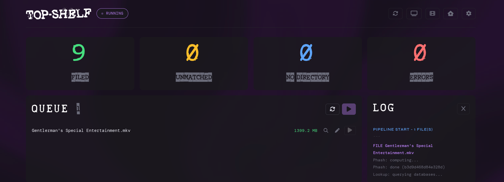

# Top-Shelf



A self-hosted media filing tool that uses perceptual hashing to automatically identify and organise adult content scenes by matching against StashDB, ThePornDB, and FansDB.

---

## What it does

Top-Shelf sits at the end of a processing pipeline (e.g. FileFlows → download folder) and:

- Computes a perceptual hash from each video using Stash's exact algorithm
- Queries StashDB, ThePornDB, and FansDB in order, stopping at the first match
- Routes matched files to the correct library folder:
  - **Series routing** — matches studio name against your Series directory subfolders
  - **Performer routing** — matches the first female performer against configured performer directories (Stars, Erotica, E-Girls, or whatever you set up)
- Generates an NFO file and downloads a thumbnail for each filed scene
- Submits phashes back to StashDB after successful matches (requires EDIT permissions)
- Caches phashes in SQLite so reruns are fast
- Watches your scene input folder and processes new files automatically after a configurable hold time
- Watches a separate download folder (NZB/torrent complete) — cleans up junk, renames gibberish filenames, moves videos to the scene input folder
- Retries unmatched files on a configurable schedule
- Provides a manual search interface for anything that doesn't match automatically
- Supports manual metadata entry with optional StashDB scene submission
- Integrates with local Stash, Jellyfin, Plex, and Emby — triggering library scans after filing
- Movies tab powered by TMDB for filing non-scene content
- Metadata tab for scraping performer/studio info and creating TVShow folders
- Prowlarr integration — search for recent scenes and send to your download client directly from the metadata page
- Library health scanner to detect missing NFOs, thumbnails, and other issues
- Password protection with bcrypt-hashed passwords and session tokens

---

## Requirements

- Docker and Docker Compose
- API keys for at least one of: StashDB, ThePornDB, FansDB
- An existing library folder structure

---

## API keys

| Service | URL |
|---------|-----|
| StashDB | https://stashdb.org → Settings → API Keys |
| ThePornDB | https://theporndb.net → Account → API Keys |
| FansDB | https://fansdb.cc → Settings → API Keys |
| TMDB (movies) | https://www.themoviedb.org → Settings → API |

---

## Quick start

1. Create your data directory on the host:
   ```bash
   mkdir -p /your/path/database
   ```

2. Copy `docker-compose.yml` to your server and edit the volume paths

3. Start the container:
   ```bash
   docker compose up -d
   ```

4. Open `http://<your-server-ip>:8891`

5. Go to Settings and enter your API keys, directory paths, and configure media server integration

---

## docker-compose.yml

```yaml
services:
  top-shelf:
    image: thefilthycount/top-shelf:latest
    container_name: top-shelf
    restart: unless-stopped
    ports:
      - "8891:8891"
    volumes:
      - /your/path/database:/app/database       # Persistent SQLite database
      - /your/library/path:/library             # Media library root
      - /your/downloads/path:/downloads         # Source files to process
    environment:
      - TZ=Europe/London
```

Adjust the host paths on the left of each volume mount. Container paths on the right stay as-is.

---

## Directory structure

```
/library/
  Series/
    Studio Name/
      Season 2024/
  Stars/
    Performer Name/
      Season 2024/
  Erotica/
  E-Girls/
  Features/        # Movies filed via TMDB
```

---

## File naming

Configurable patterns with the following tokens:

| Token | Description |
|-------|-------------|
| `{title}` | Scene title |
| `{studio}` | Studio name |
| `{performer}` | Primary performer |
| `{performers}` | All performers comma-separated |
| `{year}` | Release year |
| `{month}` | Release month |
| `{day}` | Release day |
| `{date}` | Full date YYYY-MM-DD |
| `{source}` | Match source (StashDB, ThePornDB, etc.) |

Default patterns:
- Series: `{studio} - S{year}E{month}{day} - {title}`
- Performer: `{performer} - S{year}E{month}{day} - {studio} - {title}`

Files are placed inside a `Season YYYY` subfolder automatically.

---

## Settings

| Section | Description |
|---------|-------------|
| Password Protection | bcrypt password with configurable session duration |
| Source directory | Where incoming scene files land |
| Movies source directory | Separate input folder for movies |
| Series / Features directories | Library roots |
| Performer directories | Ranked list — Stars, Erotica, E-Girls etc. |
| Naming patterns | Series and performer patterns |
| API keys | StashDB, ThePornDB, FansDB, TMDB |
| Folder watch | Auto-process new scene files with hold time |
| Download folder watch | Process NZB/torrent complete folders |
| Auto retry | Schedule for retrying unmatched files |
| Filename parsing | Pattern order, site abbreviations, strip words |
| Submit phashes to StashDB | Contribute fingerprints back (requires EDIT role) |
| Media server scans | Stash, Jellyfin, Plex, Emby — per-server toggles |
| Prowlarr | URL, API key, download category, client names |

---

## Pages

| Page | Description |
|------|-------------|
| Dashboard | Queue, live log, filing stats |
| History | Full filing history with filtering and sorting |
| Movies | TMDB movie search and filing |
| Metadata | Performer/studio scraper, recent scenes, Prowlarr search |
| Library | Health scanner — missing NFOs, thumbs, empty folders |

---

## Building from source

```bash
git clone https://github.com/the-filthy-count/Top-Shelf
cd Top-Shelf
pip install -r requirements.txt
uvicorn main:app --host 0.0.0.0 --port 8891 --reload
```

---

## Tech stack

- **Backend:** Python, FastAPI, APScheduler, Watchdog
- **Database:** SQLite
- **Phash:** FFmpeg + ImageHash, compatible with Stash's implementation
- **Frontend:** Vanilla HTML/CSS/JS, Font Awesome

---

## Acknowledgements

- [Stash](https://github.com/stashapp/stash) for the phash algorithm
- [StashDB](https://stashdb.org), [ThePornDB](https://theporndb.net), [FansDB](https://fansdb.cc) for the scene databases
- [TMDB](https://www.themoviedb.org) for movie metadata
- [Prowlarr](https://github.com/Prowlarr/Prowlarr) for indexer management

---

## Licence

MIT
