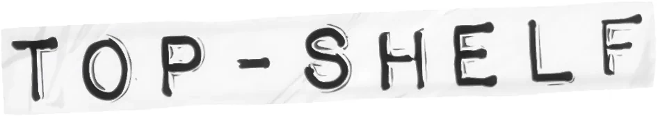
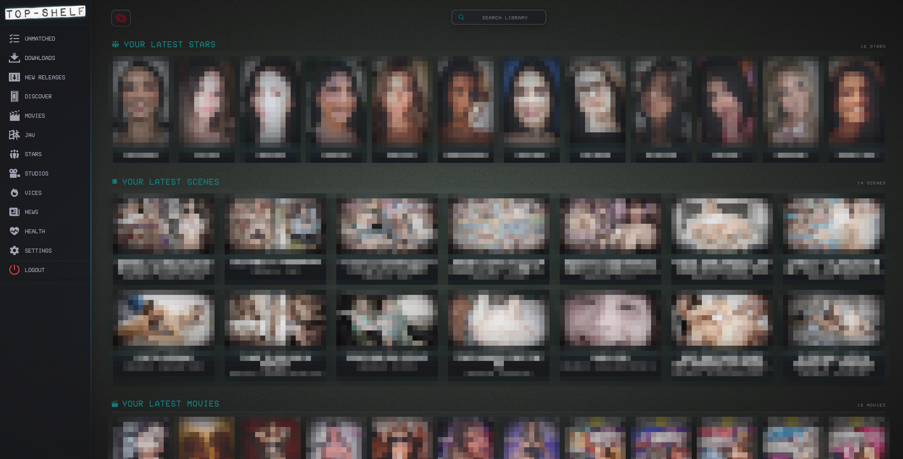
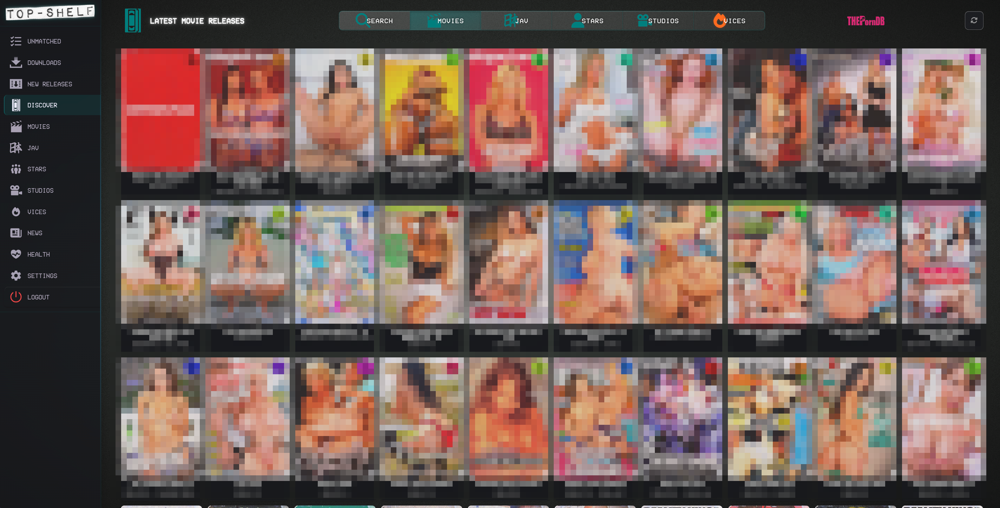
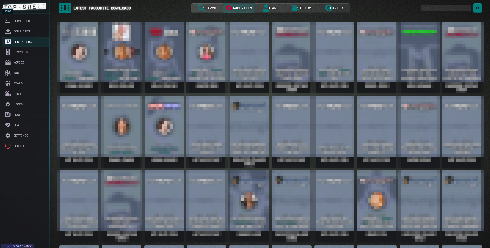
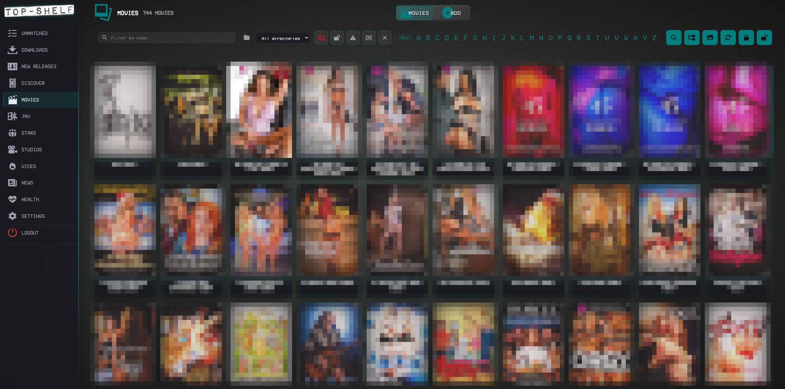
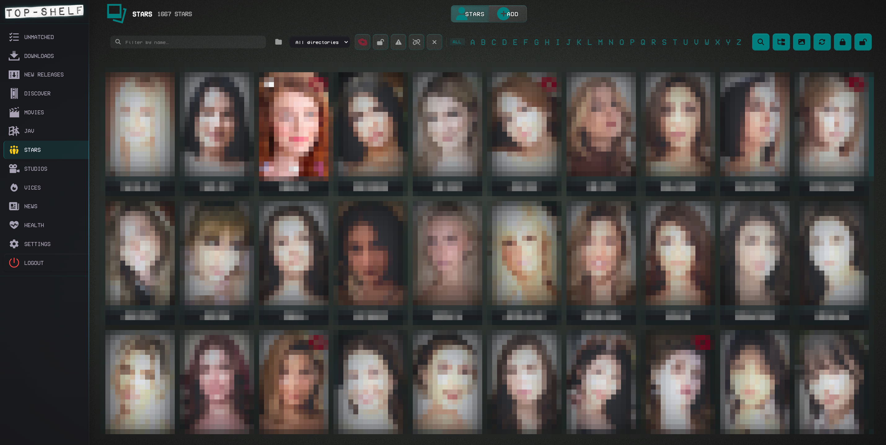
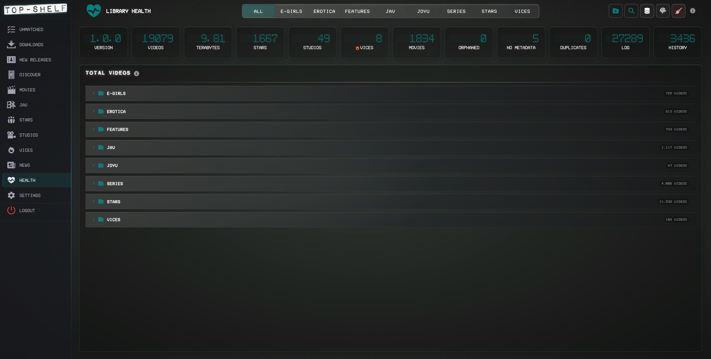
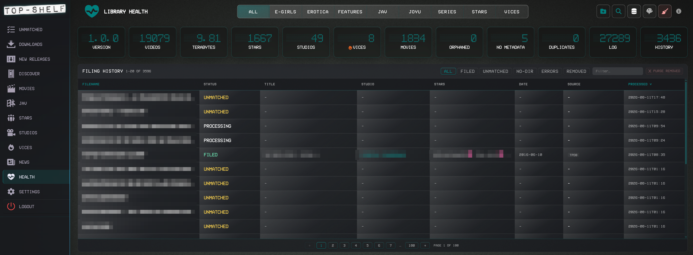

<p align="center">
  
</p>

A self-hosted media filing tool which serves as a stash app companion, and uses perceptual hashing to automatically identify and organise adult content by matching against StashDB, ThePornDB, and FansDB.

---

## How it works

Top-Shelf watches your download folders and automatically processes video files through a pipeline:

1. Computes a perceptual hash from each video using Stash's algorithm
2. Queries StashDB, ThePornDB, FansDB, and JAVStash in order, stopping at the first match
3. Routes matched files to the correct library folder based on studio or performer (and optional **library index** crosswalk from your Favourites / linked IDs)
4. Generates Kodi-compatible NFO metadata and downloads thumbnails
5. Optionally submits phashes back to StashDB to improve the database

Files that don't match automatically can be filed manually through the web interface with full metadata search and entry.

---

## The pipeline

Top-Shelf is built as a production line. Each page owns one stage, and the output of one stage is the input of the next.

```
   Discover ─► Acquire ─► Unmatch/Sort ─► Catalogue ─► Maintain
       ▲                                                    │
       │                                                    ▼
       └───────────────────────── Home ◄───────────────────
```

| Stage | Page | What it does | Hands off to |
|---|---|---|---|
| **Discover** | `/scenes` | Six feed modes — **Search**, **Movies**, **JAV**, **Stars**, **Studios**, **Vices** — pull from StashDB / TPDB / FansDB / JAVStash. Scene detail overlay opens in-place; inline **Prowlarr** search dispatches grabs to your NZB or torrent client. | Your download client (then `/downloads`) |
| **Acquire** | `/downloads` | Read-only view of NZBGet / SABnzbd / qBittorrent / Transmission / Deluge. No import button — completed releases are picked up by the **download-folder watch** and moved into the scene-input folder automatically. | `/unmatched` (via the scene-input folder) |
| **Process** | `/unmatched` (formerly `/queue`) | Files are perceptually hashed and matched against the databases (StashDB → TPDB → FansDB → JAVStash). Suggested matches surface with reason pills (duration delta, year proximity, cast size, scene index). One click files with NFO + artwork; weak matches get a manual-search fallback. Path-missing rows can be bulk-purged from `/health`. | `/stars`, `/movies`, `/jav`, `/studios` (filed rows land in the split catalogue) |
| **New Releases** | `/releases` (formerly `/index`) | RSS-indexer scan for new releases matching your library. | Prowlarr / download client |
| **Catalogue** | `/stars`, `/movies`, `/jav`, `/studios`, `/vices` | The favourites catalogue, **split by kind** — Stars for performers, Movies for feature films, JAV for Japanese releases, Studios, and Vices (tag-driven). Each page has its own **Add** tab that searches source DBs and appends to the library. Hearts star rows; locks protect matched IDs. Filing routes here based on the row's kind. | `/health` (audits) |
| **Maintain** | `/health` | Audits and cleans the catalogue: orphan NFOs, missing sidecars, empty show folders, name-similarity clusters, phash duplicate groups. **Index Library** builds `library_files` with phashes; **Rescan phash** adds verification. Movies + JAV tab has a **Missing: N** filter chip and a **Delete N missing** bulk-purge for cleaning up rows whose folder is gone from disk. | — (terminal stage) |
| **Home** | `/` | Landing page with cross-library search, favourites-only toggle, and four sections: **Your latest scenes** (StashDB/FansDB/JAVStash feed for library stars + studios + vices, opens the Discover overlay in-place on click), **Your latest stars**, **Your latest movies**, **Your latest JAV**. Sections auto-hide when empty. | `/scenes`, `/stars`, `/movies`, `/jav`, entity permalinks |

### Entity permalinks

Every performer / studio / movie has a shareable URL that opens its popup on a bare shell page — click a card anywhere and the URL becomes the deep-link:

- `/performer/{row_id}` — library performer (or `?stash=…` / `?name=…` for external)
- `/studio/{row_id}` — library studio (or `?stash=…&source=stashdb` for external)
- `/movie/{tpdb_id}` — TPDB movie id
- `/scene/{source_db}/{source_id}` — redirects to `/scenes?scene=db/id` and opens the scene overlay

Escape closes any open sub-modal first (poster picker, crop, etc.) before navigating back — `history.back()` uses bfcache so returning to the previous page is instant.

Two side branches sit alongside the main line:

- **Settings** (`/settings`) — ten categories (Security, Directories, Content Filters, Pipeline, Databases, Downloads, RSS Feeds, Media Servers, Library Health, Appearance) that configure every stage above.
- **News** (`/news`) — release / update feed.

---

## Pages

The sidebar is the primary nav (Radarr-style vertical strip); the TOP-SHELF logo top-left is the Home affordance. Order:

**Home → Unmatched → Downloads → New Releases → Discover → Movies → JAV → Stars → Studios → Vices → News → Health → Settings → Logout**

### Home (`/`)

Landing page with cross-library search, favourites-only toggle, and four content sections:

- **Cross-library search** — debounced input, dropdown groups results by kind (Stars, Movies, Studios, Vices), matches folder_name + canonical DB names + aliases. Rows link to the entity permalink.
- **Favourites toggle** — lips icon top-left of the search bar. Server pre-fetches both unfiltered and favourites-only payloads in one call so the toggle swaps arrays instantly with zero round-trip. Movies + JAV get an NFO cast join: a row counts as "favourite" if `is_favourite=1`, its studio matches a library favourite studio, OR its NFO `<actor><name>` list intersects the favourite performer folder names.
- **Your latest scenes** — 40-scene pool merged across Stars + Studios + Vices feeds, capped at 2 visible rows.
- **Your latest stars** — newest 10 performer rows, one row visible.
- **Your latest movies** — newest 10 movie rows (feature films only; JAV in its own section).
- **Your latest JAV** — newest 10 JAV rows.
- Any section with zero rows hides itself entirely.
- Background refresh on every load — the page polls `/api/home/data` every 4 s while the source-DB refresh is in flight and swaps the newer payload in when `updated_at` moves forward.

<p align="center">
  
</p>

### Discover (`/scenes`)

Six feed modes — **Search**, **Movies**, **JAV**, **Stars**, **Studios**, **Vices** — pulling from StashDB / TPDB / FansDB / JAVStash. Scene detail overlay opens in-place from any card. Inline Prowlarr search sits below for grabs.

- **Search** — performers or studios / scene title / date range across configured DBs. Adult-flagged TMDB results are prioritised.
- **Stars mode** — recent StashDB / FansDB / JAVStash scenes credited to any library performer with a matching cross-ref id.
- **Studios mode** — recent StashDB scenes credited to any library studio.
- **Vices mode** — StashDB scenes whose tags intersect the vices you've configured.

<p align="center">
  
</p>

### Unmatched (`/unmatched`; legacy `/queue` and `/dashboard` still redirect)

The processing dashboard:

- **Stats** — filed, unmatched, no directory, errors
- **Queue** — files in your scene source directory with status, size, phash cache; subfolders are walked recursively
- **Log** — live processing log
- **Manual filing** — search databases, pick a scene, file with optional StashDB submission

### New Releases (`/releases`; legacy `/index` still redirects)

RSS indexer feed of new releases matching your library — grabs go through Prowlarr to your NZB/torrent client.

<p align="center">
  
</p>

### Movies (`/movies`), JAV (`/jav`)

Split panels (formerly a single Movies tab). Movies is TMDB-first, JAV is JAVStash-first. Each has its own **Add** tab that searches source DBs and appends to the library. Poster picker on each row for headshot / primary / secondary art.

<p align="center">
  
</p>

### Stars (`/stars`)

Split from the old `/library`. Grid of every library performer row with TPDB / StashDB / FansDB / JAVStash cross-refs, aliases, group members. Click a tile → full performer popup on `/performer/{row_id}` with linked scenes, alias editor, poster picker, and DB re-link flow.

<p align="center">
  
</p>

### Studios (`/studios`)

Split from the old `/library`. Studio-tile grid with a linked-studios strip below the parent logo — each linked sibling site (Hoby Buchanon.com → parent Hoby Buchanon) shows as its own card with source badge + logo + name. Filing routes child scenes to the parent folder via the `group_ids_json` name index.

### Vices (`/vices`)

Tag-driven "collections" (e.g. "Rough", "Solo") — vices are stored in settings, not `favourite_entities`, and match on scene tags (never studio/performer name). No Add tab; configure vices in settings.

### Downloads (`/downloads`)

Read-only view of NZB/torrent clients (queue/history and categories). Completed releases are picked up by the download-folder watch — no client "import" button.

### Health (`/health`)

Library maintenance:

- **Scan Library** — walks configured roots and reports issues.
- **Index Library** — builds `library_files` with phashes and probe data.
- **Rescan phash** (`phash_3`) — verification fingerprint per row.
- **Movies + JAV panel** — filter chips per source (TPDB / TMDB / JAVStash), tri-state (Any / Has / Missing). A **Missing: N** chip (hidden when zero) toggles to a bulk-purge action: **Delete N missing** removes every row whose folder is gone from disk.
- **Total Videos**, **Duplicates**, **Orphaned**, **Log**, **History** panels.
- Legacy `/history` redirects here.

<p align="center">
  
</p>

<p align="center">
  
</p>

### Settings (`/settings`)

Ten categories in this order: **Security → Directories → Content Filters → Pipeline → Databases → Downloads → RSS Feeds → Media Servers → Library Health → Appearance**.

### News (`/news`)

Release / update announcements feed.

---

## Automation

### Folder Watch

Monitors your **scene input** directory for new files. After the configured hold time without changes, each file runs through the full pipeline.

### Download Folder Watch

Monitors your **download watch** directory for completed downloads. Strips junk, can rename gibberish filenames from the parent folder name, and moves video into the **scene input** folder for processing.

### Automatic Retry

Reruns the pipeline on unmatched files on a schedule so new database entries can match later.

### Favourites scan

Scheduled (optional) refresh of Favourites index / matching — configured in Settings alongside other jobs.

### TPDB Favourites Sync

Bidirectional sync between your library and ThePornDB favourites:

- **Library → TPDB** — performer/studio directories searched on TPDB and added to your TPDB favourites (when enabled)
- **TPDB → Library** — TVShow folders for favourited performers not yet present locally

Runs on a schedule or manually from Settings.

---

## Download Integration

### Prowlarr

Search across configured indexers from the Scenes page (and related UIs). Grabs go to your NZB or torrent client with category assignment.

### Download Clients

Direct API integration (no Prowlarr required for client credentials):

- **NZB:** NZBGet, SABnzbd
- **Torrent:** qBittorrent, Transmission, Deluge

Handles magnet redirects, qBittorrent CSRF, and categories. Optional: after **download folder watch** processes a release, Top-Shelf can remove the matching client job when that setting is enabled.

---

## Media Server Integration

Triggers library scans after filing on Stash, Jellyfin, Plex, and Emby. Scans are debounced so bursts of files still coalesce.

---

## File Routing

### Series routing

Matches the scene’s studio to subfolders under your **Series** directory.

### Performer routing

Matches performers against configured performer directory roots in order. Prioritises female performers by default; optional alias expansion when enabled.

### Library index (Favourites crosswalk)

When enabled, queue routing can use folder ↔ database ID links from the Favourites index before pure name/alias matching.

### Naming patterns

Configurable tokens: `{title}`, `{studio}`, `{performer}`, `{performers}`, `{year}`, `{month}`, `{day}`, `{date}`, `{source}`.

Default patterns:

- Series: `{studio} - S{year}E{month}{day} - {title}`
- Performer: `{performer} - S{year}E{month}{day} - {studio} - {title}`

Files go under a `Season YYYY` subfolder automatically.

---

## Quick start

1. Create your data directory:
   ```bash
   mkdir -p /your/path/database
   ```

2. Copy `docker-compose.yml` and edit volume paths (library, downloads, and database).

3. Start the container:
   ```bash
   docker compose up -d
   ```

4. Open `http://<your-server-ip>:8891` (redirects to **Scenes**).

5. Set a password, add API keys, and configure directories in **Settings**.

---

## docker-compose.yml

```yaml
services:
  top-shelf:
    image: thefilthycount/top-shelf:latest
    container_name: top-shelf
    restart: unless-stopped
    ports:
      - "8891:8891"
    volumes:
      - /your/path/database:/app/database
      - /your/library/path:/library
      - /your/downloads/path:/downloads
    environment:
      - TZ=Europe/London
```

Mount paths so **Download watch**, **scene input**, and **movies input** in Settings match real paths inside the container (same idea as your torrent client if it runs elsewhere).

---

## API keys

| Service | Where to get one |
|---------|-----------------|
| StashDB | https://stashdb.org → Settings → API Keys |
| ThePornDB | https://theporndb.net → Account → API Keys |
| FansDB | https://fansdb.cc → Settings → API Keys |
| JAVStash | https://javstash.org → Settings → API Keys |
| TMDB | https://www.themoviedb.org → Settings → API |

---

## Security

Password protection with bcrypt and session tokens. Sessions expire after a configurable duration (default 24 hours). Login on first access and after expiry.

---

## Tech stack

- **Backend:** Python, FastAPI, APScheduler, Watchdog
- **Database:** SQLite
- **Phash:** FFmpeg + ImageHash (Stash-compatible)
- **Frontend:** Vanilla HTML/CSS/JS, Font Awesome, Web Awesome (icons on some views), shared `app-shell` styles
- **Fonts:** Tox Typewriter (display), Impact Label / Impact Label Reversed (labels, toggles, and parts of Library Health)

---

## Acknowledgements

- [Stash](https://github.com/stashapp/stash) for the phash algorithm
- [StashDB](https://stashdb.org), [ThePornDB](https://theporndb.net), [FansDB](https://fansdb.cc), [JAVStash](https://javstash.org) for scene databases
- [TMDB](https://www.themoviedb.org) for movie metadata
- [Prowlarr](https://github.com/Prowlarr/Prowlarr) for indexer management

---

## Licence

MIT
